# KaseiCoin

The KaseiCoin project is an example of how to develop a monetary system based on blockchain technology, creating a fungible token that’s ERC-20 compliant and deploying it using smart contracts.

The files created for the project are:
- KaseiCoin.sol
- KaseiCoinCrowdsale.sol

The steps for its development are divided into the following subsections:

1. Create the KaseiCoin Token Contract

2. Create the KaseiCoin Crowdsale Contract

3. Create the KaseiCoin Deployer Contract

4. Deploy and Test the Crowdsale on a Local Blockchain

This token will be minted by using a Crowdsale contract from the OpenZeppelin Solidity library. The created crowdsale contract will manage the entire crowdsale process. This process will allow users to send ether to the contract and receive KaseiCoin tokens, or KC, in return. The contract will automatically mint the tokens and distribute them to a buyer in one transaction.

In the next part it is explained the development process of KaseiCoin:

1. The KaseiCoin Token Contract:

 

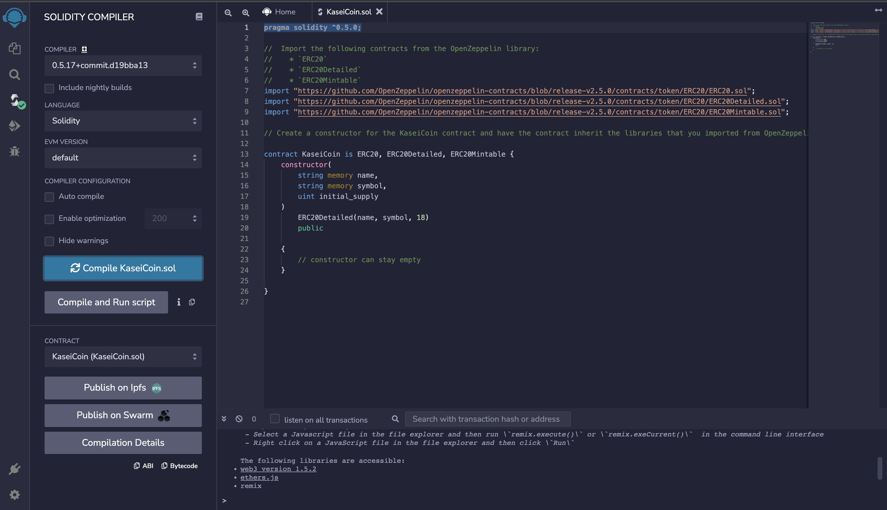
 
 

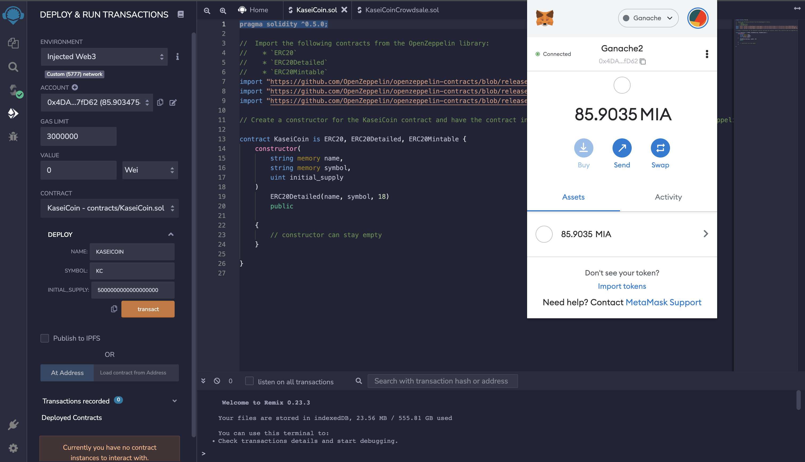
 
 

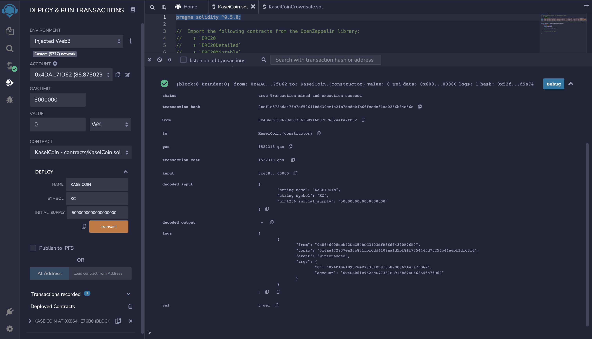
 
 

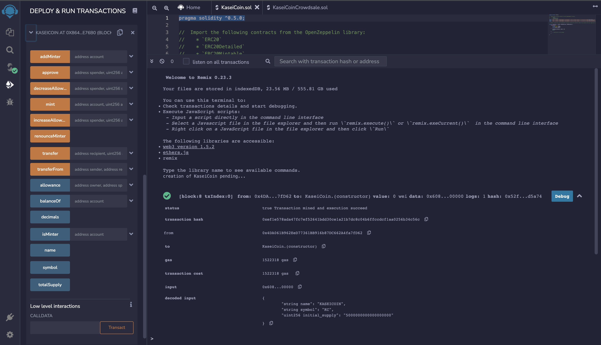
 
 

2. The KaseiCoin Crowdsale Contract:

 

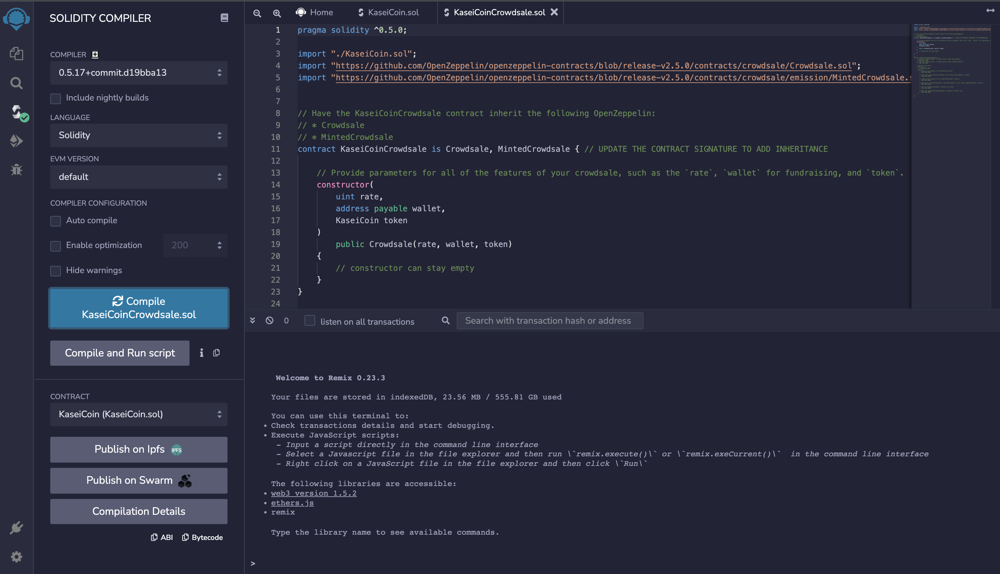
 
 

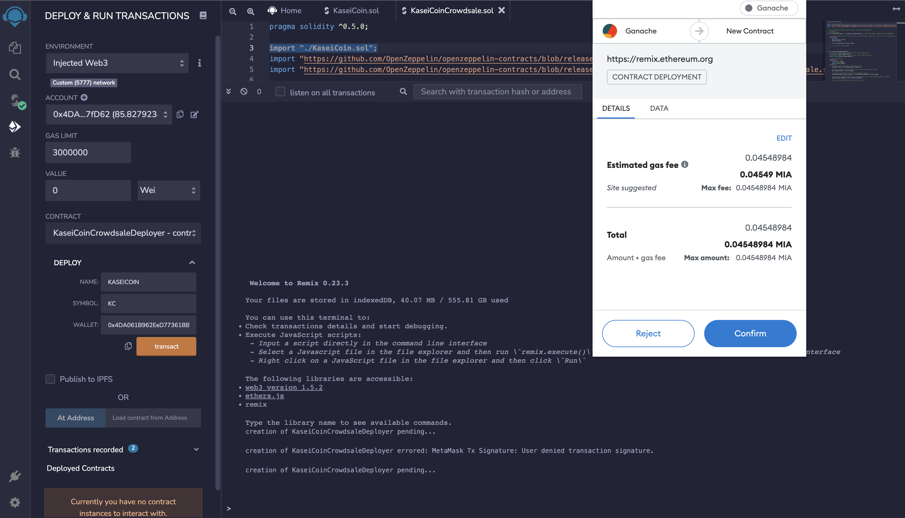
 
 

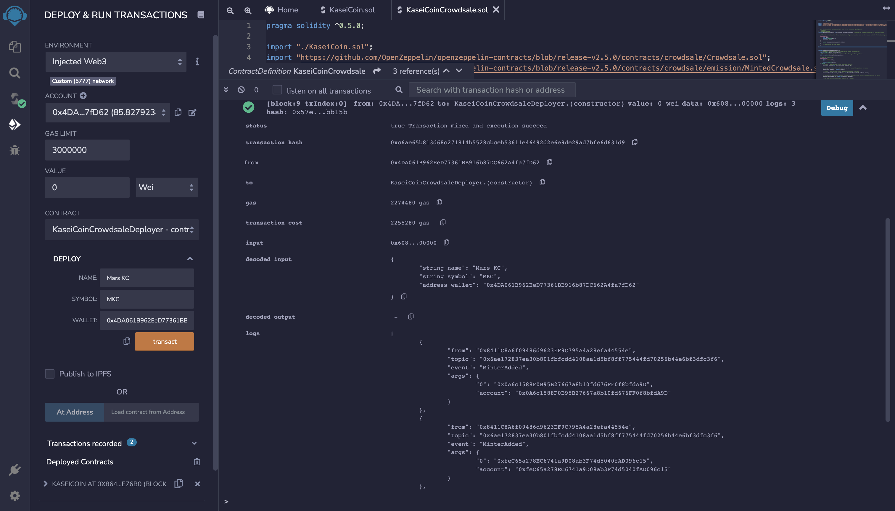
 
 

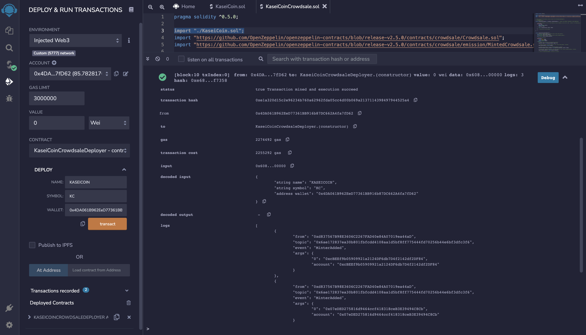
 
 

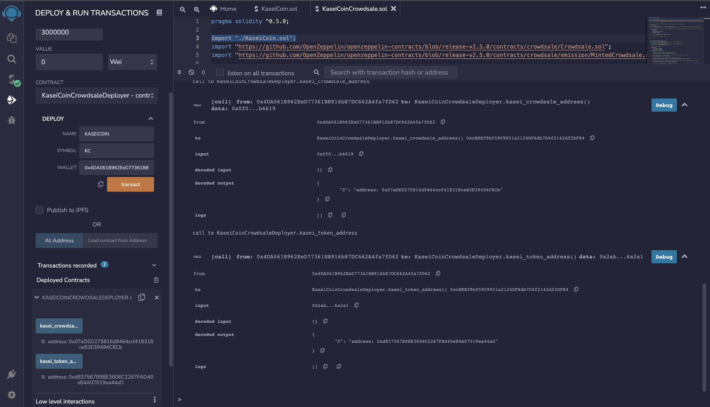
 
 

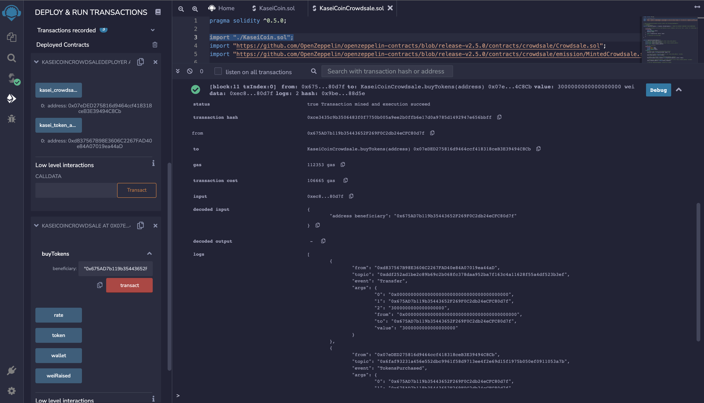
 
 

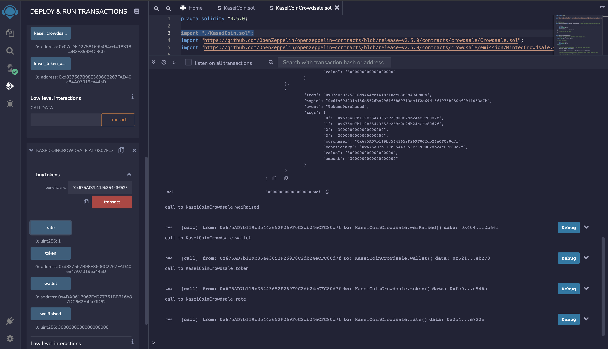
 
 

Here there is a short video for a better understanding of all the developing process of the KaseiCoin project:

https://github.com/Jraigos/KaseiCoin/blob/main/KaseiCoin.mov

